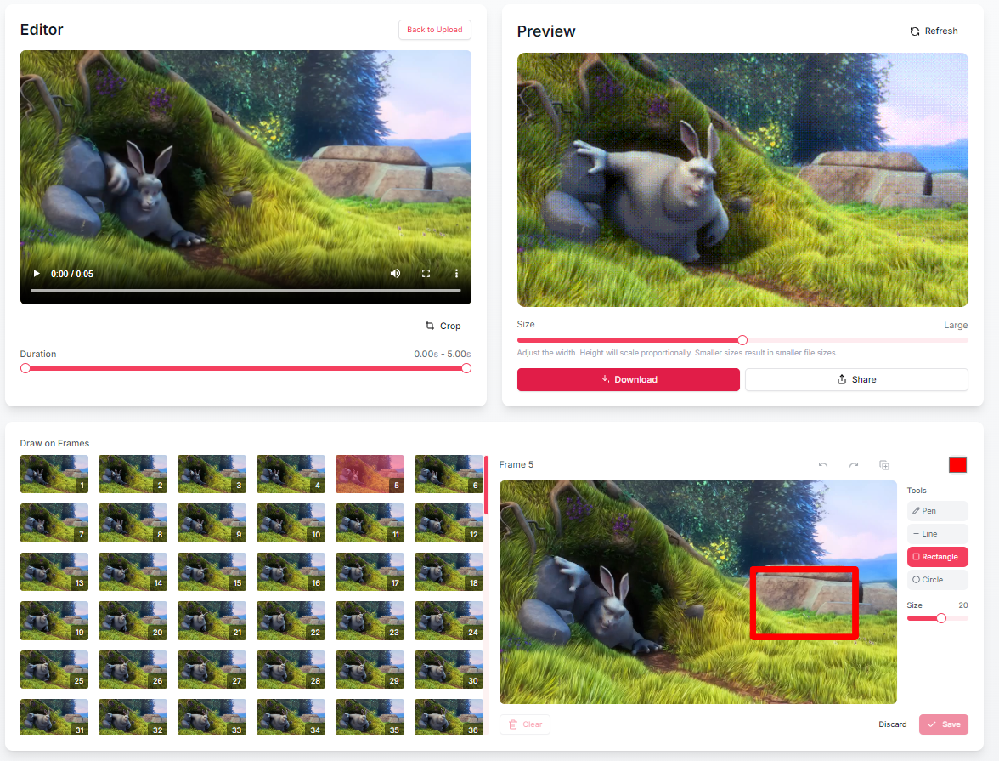

# Make Your GIF

A modern web application that allows you to create, edit, and customize GIFs directly in your browser. Built with Next.js, TypeScript, Tailwind and FFmpeg.



## Features

- [x] Record videos directly from your webcam
- [x] Convert videos to GIF format
- [x] Draw and annotate individual frames
- [x] Crop and adjust your GIF
- [x] Frame-by-frame editing capabilities
- [x] Drag and drop file support
- [x] Preview your GIF before saving

## Getting Started

First, install the dependencies:

```bash
npm install
# or
yarn install
# or
pnpm install
```

Then, run the development server:

```bash
npm run dev
# or
yarn dev
# or
pnpm dev
```

Open [http://localhost:3000](http://localhost:3000) with your browser to start creating your GIFs!

## Tech Stack

- [Next.js](https://nextjs.org/) - React framework
- TypeScript - For type safety
- Modern browser APIs for video/camera handling
- Canvas-based drawing tools

## Contributing

Contributions are welcome! Please feel free to submit a Pull Request.

## License

[MIT License](LICENSE)
